<div align="center">

[](README.md)
[](README.ru.md)

<picture><source media="(prefers-color-scheme: dark)" srcset="screenshots/header-dark.svg"></picture>

**A monochrome LuCI theme for OpenWrt, drawn on a pixel grid.**<br>
Pixel font, notched frames, CRT scanlines and stepped animations for every page of the web interface.

[](https://github.com/Trendorin/luci-theme-pixel/releases/latest)
[](https://github.com/Trendorin/luci-theme-pixel/releases)
[](LICENSE)
<br>
[](#compatibility)
[](#install)
[](https://github.com/Trendorin/luci-theme-pixel/releases/latest)
[](#features)


[](https://github.com/Trendorin/luci-theme-pixel/releases/latest)
[](#install)
[](#screenshots)

</div>

## Install

The package is architecture independent. Run on the router (SSH):

**OpenWrt 25.12 and newer** (apk)

```sh
cd /tmp
wget https://github.com/Trendorin/luci-theme-pixel/releases/latest/download/luci-theme-pixel.apk
apk add --allow-untrusted luci-theme-pixel.apk
```

**OpenWrt 23.05 and 24.10** (opkg)

```sh
cd /tmp
wget https://github.com/Trendorin/luci-theme-pixel/releases/latest/download/luci-theme-pixel_all.ipk
opkg install luci-theme-pixel_all.ipk
```

Reload the web interface. A first install makes Pixel the active theme; upgrades keep whichever theme you chose.
Versioned files and checksums (`SHA256SUMS`) are on the [releases page](https://github.com/Trendorin/luci-theme-pixel/releases).

<details>
<summary><b>Switch, upgrade or remove</b></summary>

- **Switch themes:** System → System → Language and Style → Design. From the shell:
  `uci set luci.main.mediaurlbase=/luci-static/bootstrap && uci commit luci`.
- **Upgrade:** run the same two commands again. The active theme stays as it is.
- **Remove:** `apk del luci-theme-pixel` or `opkg remove luci-theme-pixel`. If Pixel was active, LuCI falls back to Bootstrap.
- **Old parts of the page still show?** Reload once with <kbd>Ctrl</kbd>+<kbd>Shift</kbd>+<kbd>R</kbd>.
- **Phone icon:** open LuCI in Chrome or Samsung Internet → menu → **Add to Home screen**.

</details>

## Screenshots

All pages are stock LuCI; only the theme differs. Addresses, names and logs in the pictures are made up.

### Dark and light

The theme toggle in the top bar cycles **auto → dark → light**. "Screens" such as the sign-in art and logs stay dark in both.

| Status overview, dark | The same page, light |
|---|---|
| 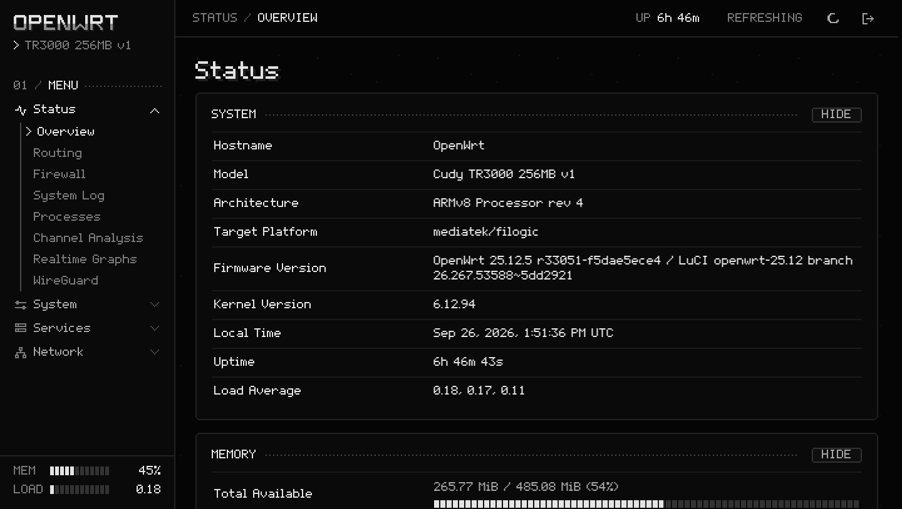 | 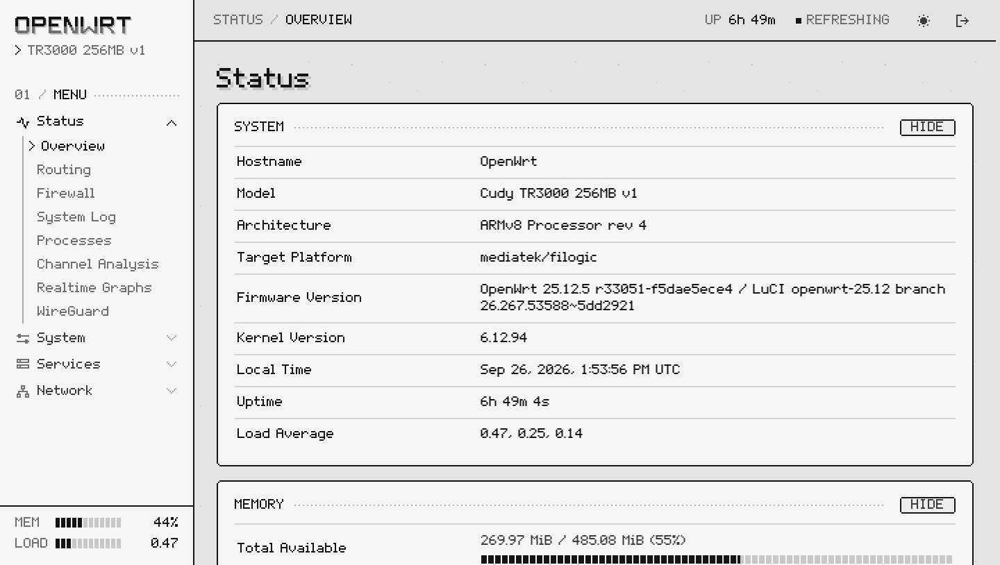 |

### Everyday pages

| Network → Interfaces | Network → Wireless |
|---|---|
| 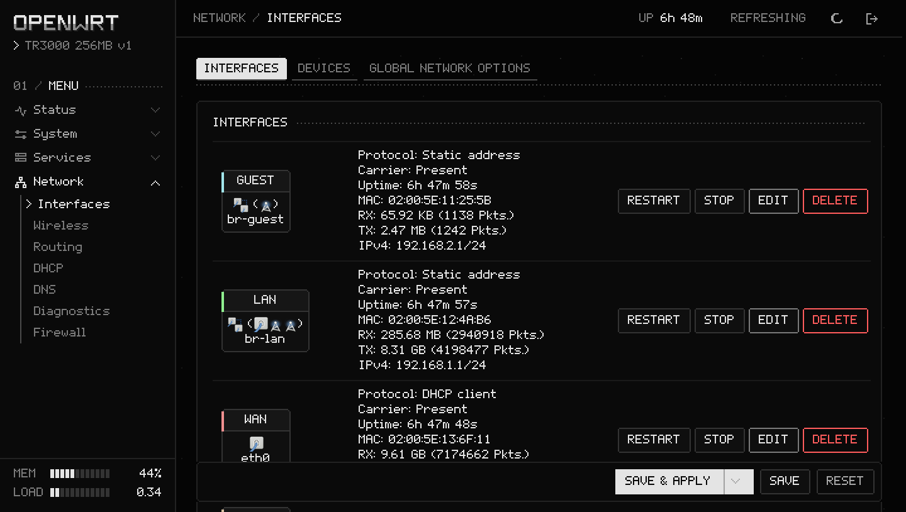 | 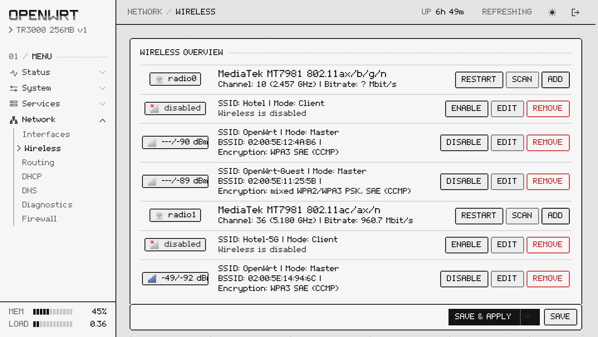 |

### Dialogs and logs

| Edit dialog: a 1-bit window with a striped title bar | System Log as a scrolling screen |
|---|---|
| 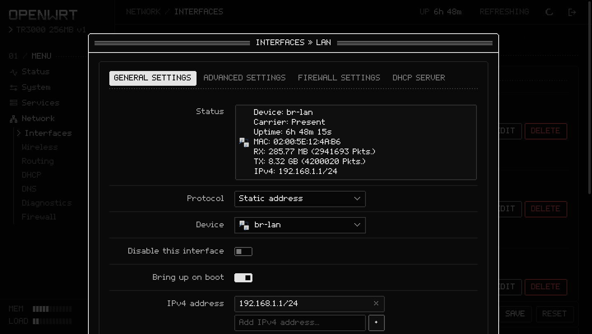 | 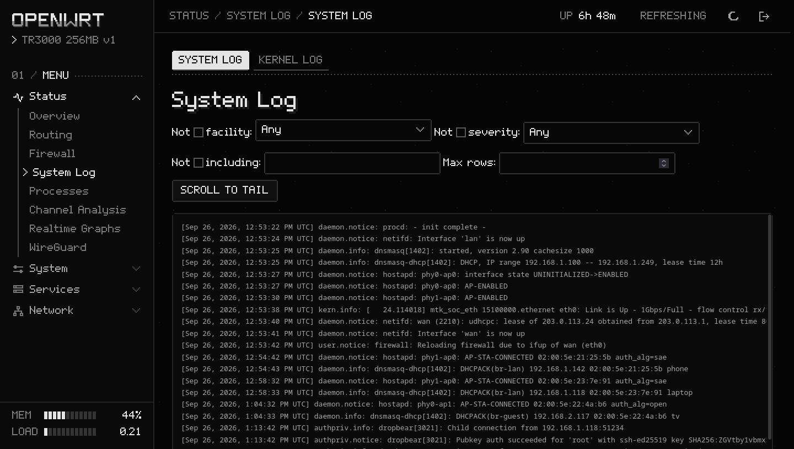 |

### Graphs and settings

| Realtime graphs on a dark screen | Language and Style: choosing the theme |
|---|---|
| 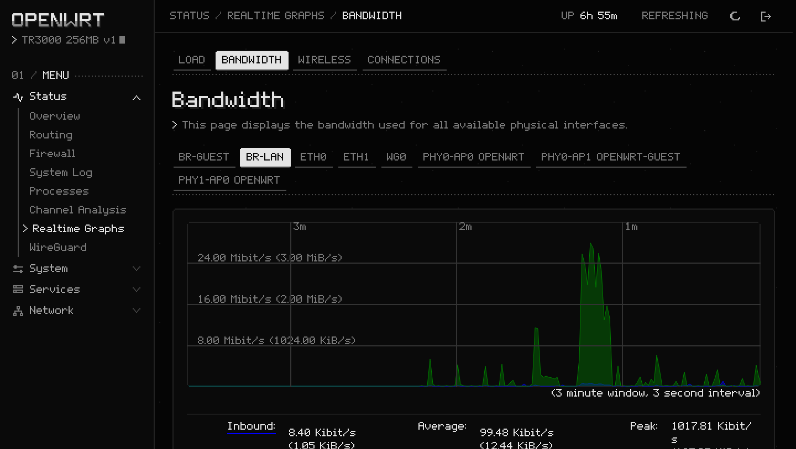 | 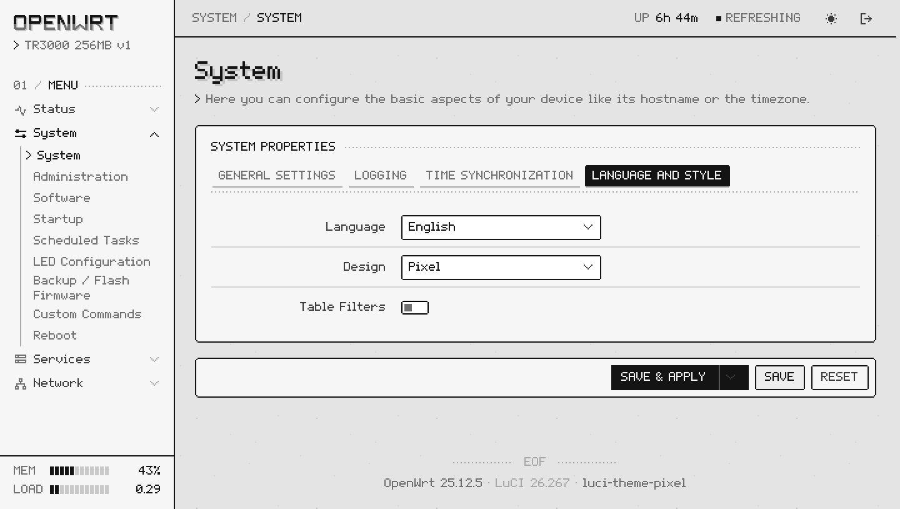 |

### On a phone

| Sign-in | Status | Menu |
|---|---|---|
| 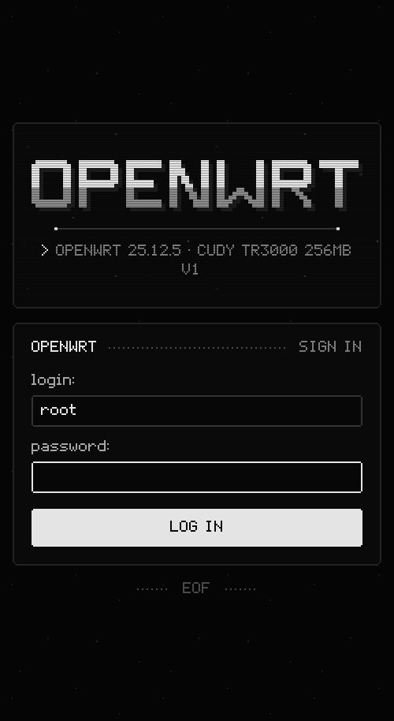 | 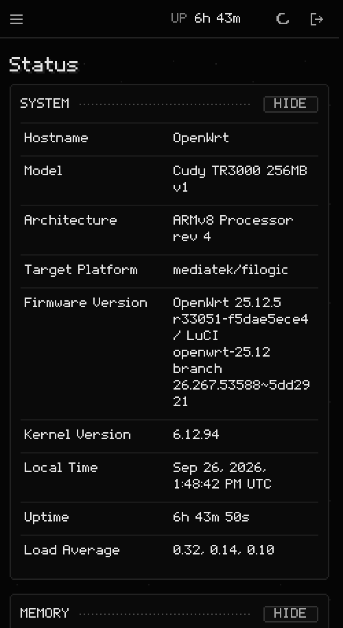 | 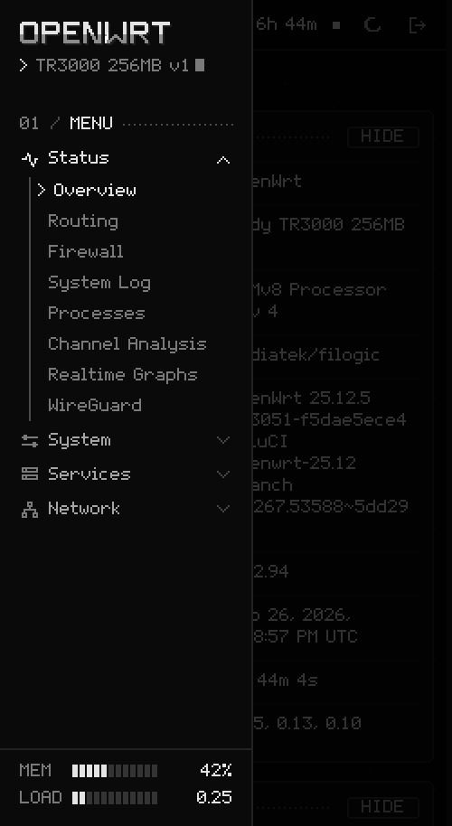 |

## Features

- **Pixel 5x7 font** with Latin, Cyrillic and UI symbols (%, °, arrows, «», ✓…), built from bitmap glyphs.
  Sizes are multiples of 10 px, so every font pixel lands on whole screen pixels and text stays sharp;
  each glyph is one outline, so there are no hairline seams on phones with fractional scaling.
- **Screen palette:** near-black and light-grey tones, notched pixel frames, dotted rules and CRT scanlines.
  Red appears only for errors and destructive buttons.
- **Motion, all stepped:** the hostname decodes out of pixel noise letter by letter and a glint sweeps across it,
  subtitles type themselves behind a blinking block cursor, pages flicker in like an old monitor, the spinner is a
  walking pixel block. `prefers-reduced-motion` turns it all off.
- **Every stock LuCI widget restyled:** forms, tabs, tables, drop-downs, dynamic lists, pixel checkboxes and switches,
  segmented progress bars, modal windows, status boxes, zone badges, log pages and realtime graphs.
- **Sidebar and top bar:** live memory and load in the sidebar, uptime in the top bar (standard `system info` call).
- **Phone layout** with an off-canvas menu, home-screen icons and a web app manifest.
- **Self-contained:** fonts and art are served by the router. No external requests, no backend, no extra ACLs.

## Compatibility

| OpenWrt | Package | Status |
|---|---|---|
| 25.12 | `.apk` | Tested on 25.12.5 (LuCI 26.267), Cudy TR3000: install, upgrade, remove, reinstall |
| 24.10 | `.ipk` | Built with the 24.10 SDK; same ucode theme API, not yet installed on a 24.10 router |
| 23.05 | `.ipk` | Same ucode theme API; not yet installed on a 23.05 router |

LuCI with ucode templates is required. Any modern browser works (the theme uses CSS `clip-path`, `color-mix` and
custom properties). Reports from other routers and versions are welcome in [issues](https://github.com/Trendorin/luci-theme-pixel/issues).

## Build from source

With the OpenWrt SDK or buildroot:

```sh
cp -r luci-theme-pixel <sdk>/package/
cd <sdk> && make defconfig && make package/luci-theme-pixel/compile
```

Without the SDK, `tools/build_pkg.py [OUTDIR]` builds the same `.apk` and `.ipk` (layout, metadata and install
scripts of the Makefile; the `.apk` needs apk-tools 3, e.g. `dnf install apk-tools`).

| Tool | What it does |
|---|---|
| `tools/profile_glyphs.py` | 5x7 glyphs and the 12-row display font |
| `tools/extra_glyphs.py` | Cyrillic letters and UI symbols |
| `tools/build_font.py` | builds `fonts/pixel-5x7.woff2` (needs `fonttools` and `brotli`) |
| `tools/build_art.py` | favicon, home-screen icons and the web app manifest (standard library only) |
| `tools/build_pkg.py` | `.apk` and `.ipk` without the SDK |
| `tools/preview/` | local preview: theme files from this repository, stock LuCI views and read-only ubus calls proxied to a real router over SSH. `SANITIZE=1` replaces MACs, IPs, SSIDs, names and secrets, `DEMO=1` shows invented logs; `shot.py` takes screenshots and `anim.py` records the sign-in GIF |

## Changelog

- **1.0.2** — realtime graphs (load, bandwidth, wireless, connections) are drawn on a dark screen with a visible grid
  instead of a white box with near-invisible lines; version-free download links; Russian documentation and new screenshots.
- **1.0.1** — log pages (System Log, Kernel Log, Travelmate) are a dark scrolling screen instead of a text box as tall
  as the whole log; the striped title bar of modal windows reaches the right edge; packages can be built without the SDK.
- **1.0.0** — first release.

Details and files for every version are on the [releases page](https://github.com/Trendorin/luci-theme-pixel/releases).

## Credits and license

The 5x7 and display glyphs come from the pixel profile of [Trendon (@Trendorin)](https://github.com/Trendorin).
Licensed under the [Apache License 2.0](LICENSE).
