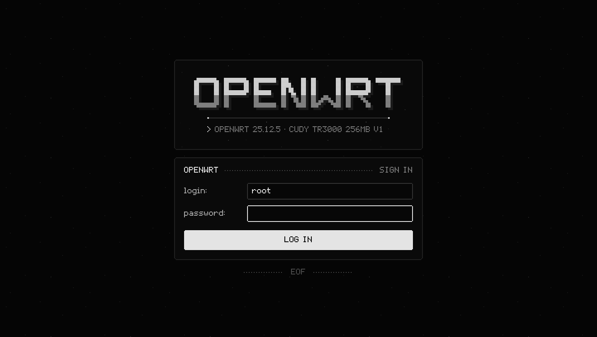
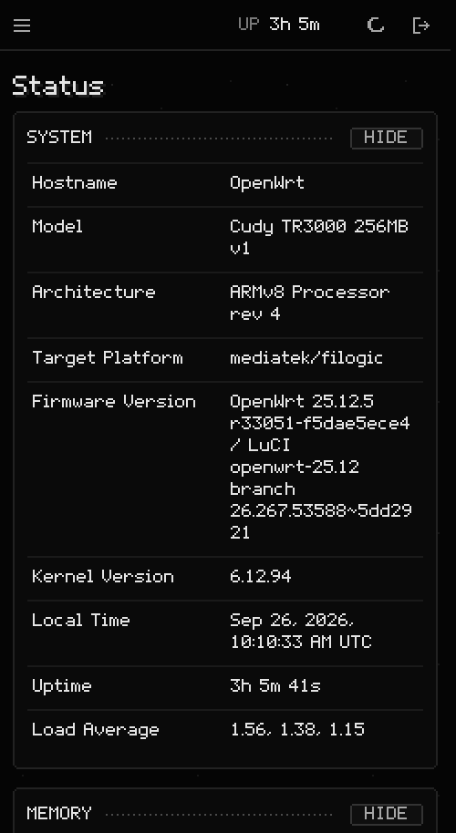
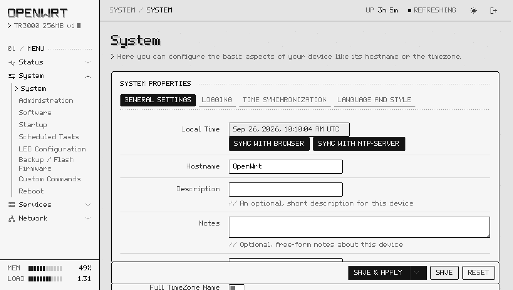

<div align="center">

<picture><source media="(prefers-color-scheme: dark)" srcset="screenshots/header-dark.svg"></picture>

**luci-theme-pixel** is a monochrome LuCI theme for OpenWrt, drawn on a pixel grid.

 
 

</div>

## Features

- **Pixel 5x7 font** with Latin, Cyrillic and UI symbols, built from bitmap glyphs.
  Sizes are multiples of 10px (20px draws 2px pixels, 40px draws 4px), so text stays sharp.
  Each glyph is traced as one outline, so there are no hairline seams on phones with fractional scaling.
- **Screen palette:** near-black and light-grey tones, notched pixel frames, dotted rules and CRT
  scanlines. Red appears only for errors and destructive buttons.
- **Motion:**
  - the hostname wordmark decodes out of pixel noise, letter by letter, and a glint sweeps across it;
  - subtitles type themselves behind a blinking block cursor;
  - pages flicker in like an old monitor;
  - the spinner is a walking pixel block;
  - a slow refresh band rolls down the sign-in screen.

  All of it is stepped, and `prefers-reduced-motion` turns it off.
- **Every stock LuCI widget is restyled:**
  - forms, tabs, tables, drop-downs, dynamic lists;
  - square pixel checkboxes and switches;
  - segmented progress bars;
  - modal windows with a striped 1-bit title bar;
  - status boxes and zone badges.
- **Sidebar and top bar:** a live memory/load readout in the sidebar and uptime in the top bar, both from the standard `system info` ubus call.
- **Dark, light and automatic** themes (toggle in the top bar), phone layout with an off-canvas menu,
  and home-screen icons plus a web app manifest.
- **Self-contained:** fonts and art are served by the router. The theme makes no external requests and needs no backend or extra ACLs.

<div align="center">
  
</div>

## Install

Download the package for your OpenWrt release from the [latest release](https://github.com/Trendorin/luci-theme-pixel/releases/latest),
copy it to the router and install it. The package is architecture independent (`noarch` / `all`).

**OpenWrt 25.12 and newer (apk)**

```sh
cd /tmp
wget https://github.com/Trendorin/luci-theme-pixel/releases/download/v1.0.1/luci-theme-pixel-1.0.1-r1.apk
apk add --allow-untrusted luci-theme-pixel-1.0.1-r1.apk
```

**OpenWrt 23.05 and 24.10 (opkg)**

```sh
cd /tmp
wget https://github.com/Trendorin/luci-theme-pixel/releases/download/v1.0.1/luci-theme-pixel_1.0.1-r1_all.ipk
opkg install luci-theme-pixel_1.0.1-r1_all.ipk
```

Installing the package makes Pixel the active theme. To switch back and forth, use
**System → System → Language and Style → Design**. Removing the package (`apk del luci-theme-pixel`
or `opkg remove luci-theme-pixel`) switches back to Bootstrap.

If your browser still shows parts of the old theme, reload once with <kbd>Ctrl</kbd>+<kbd>Shift</kbd>+<kbd>R</kbd>.

On a phone, open LuCI in Chrome or Samsung Internet and use **Add to Home screen** to get the pixel icon.

## Build from source

The theme is a plain OpenWrt package. Copy the repository into an OpenWrt SDK or buildroot:

```sh
cp -r luci-theme-pixel <sdk>/package/
cd <sdk> && make defconfig && make package/luci-theme-pixel/compile
# -> bin/packages/<arch>/base/luci-theme-pixel-*.apk (25.12+) or luci-theme-pixel_*_all.ipk (24.10, 23.05)
```

Without the SDK, `tools/build_pkg.py [OUTDIR]` builds the same `.apk` and `.ipk` (layout, metadata and install
scripts as the Makefile; the `.apk` needs apk-tools 3, e.g. `dnf install apk-tools`).

Sources of the art are in `tools/`:

| File | What |
|---|---|
| `profile_glyphs.py` | 5x7 glyphs and the 12-row display font |
| `extra_glyphs.py` | Cyrillic letters and UI symbols (%, °, arrows, «», ✓…) |
| `build_font.py` | builds `fonts/pixel-5x7.woff2` (needs `fonttools` and `brotli`) |
| `build_art.py` | favicon, home-screen icons and the web app manifest (standard library only) |
| `preview/` | a local preview: theme files from this repository, stock LuCI views and read-only ubus calls proxied to a real router over SSH; `SANITIZE=1` replaces MACs, IPs, SSIDs and host names for screenshots |

## Changes

- **1.0.1** — log pages (System Log, Kernel Log, Travelmate) are a scrolling screen instead of a text box as tall
  as the whole log; the striped title bar of modal windows now reaches the right edge.
- **1.0.0** — first release.

## Compatibility

LuCI with ucode templates, which covers OpenWrt 23.05, 24.10 and 25.12. Tested on OpenWrt 25.12.5 (LuCI 26.267) with install, uninstall and reinstall on a Cudy TR3000.
The 23.05 and 24.10 support relies on their theme API matching 25.12's; the `.ipk` has been built with the 24.10.8 SDK but not installed on a 24.10 or 23.05 router yet.
Modern browsers only (the theme uses CSS `clip-path`, `color-mix` and custom properties).

## Credits and license

The 5x7 and display glyphs come from the pixel profile of [Trendon (@Trendorin)](https://github.com/Trendorin).
Licensed under the [Apache License 2.0](LICENSE).

---

### По-русски

**luci-theme-pixel** — монохромная пиксельная тема для веб-интерфейса OpenWrt (LuCI).

Что в ней есть:
- пиксельный шрифт 5×7 с кириллицей;
- рамки со срезанными углами и строки развёртки как на ЭЛТ-мониторе;
- имя роутера, которое проявляется из шума;
- печатающиеся подзаголовки;
- тёмная, светлая и автоматическая тема, вёрстка под телефон, иконка для главного экрана.

Установка: скачайте пакет из [релизов](https://github.com/Trendorin/luci-theme-pixel/releases/latest):
- OpenWrt 25.12 и новее: `apk add --allow-untrusted <файл>.apk`;
- OpenWrt 23.05 и 24.10: `opkg install <файл>.ipk`.

Тема включится сама. Переключить её можно в **System → System → Language and Style**.
